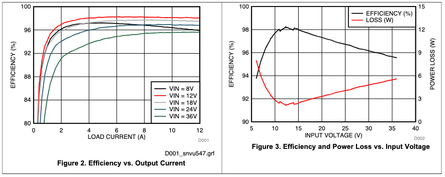
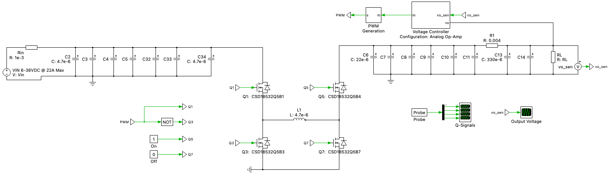
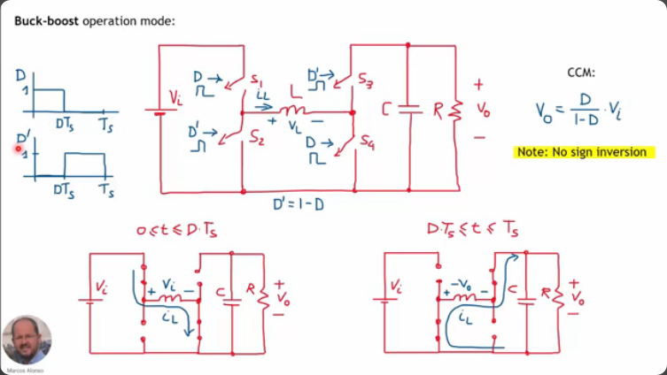
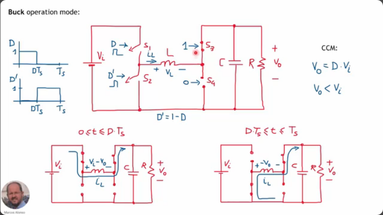

# report
Kit URL: "https://www.ti.com/tool/LM5176EVM-HP"

# 1. Documentation & Understanding

[LM5176EVM-HP User Guide + BOM](../docs/snvu547.pdf) 

[LM5176 (Logic) User Guide + BOM](../docs/lm5176.pdf)

## 1.1 Properties

| Category     | Value      |
| ------------- | ------------- |
| Topology | Buck-Boost |
| Input Range (VIN) | 6-36V DC|
| Output Voltage | 12 V (adjustable)|
| Output Current | 12 A |
| Output Power | 144 W |
| Default Switching Frequency | 250 kHZ (programmable via resistor)|
| Board Size | 9.14 cm x 9.14 cm |

**Efficiency according to TI:**

"Ultra high (>98%) peak power conversion efficiency"

## 1.2 Critical Components

### 1.2.1 Selection Switches

| Switch    | Position     | Result |
| ------------- | ------------- | ------------- |
| S1 MODE | 2 | Hiccup mode enabled and CCM |
| | 3 | Hiccup disabled and CCM |
| S2 ENABLE | 1 | LM5176 disabled |
| | 2 | EN pin along resistor divider network to set LM5176 UVLO threshold (Choose R to set at which level of VIN the EN-pin reaches 1.2 Volt and starts the LM5176 starts)|
| | 3 | LM5176 enabled |
| S3 DITHER | 1 | frequency dithering feature disabled | 
| | 2 | frequency dithering feature enabled | 

# 2. Simulation Model

LM5176EVM-HP schematic provided in the Documentation  ...

... The LM5176 schematic can bee seen in the following block diagram:

## 2.1 Buckmode

# 3. Stress & Margin Analysis

# 4. Spectral Analysis

# 5. Loss And Efficiency Comparison

# 6. Lab Measurements (if possible)

# 7. Conclusion & (optional) Improvement Proposal

# Notes

Source: https://youtu.be/I6fQurZZ5Ac?si=0BYR1ho-uJuIPpQX

- Isolated (Yes/No): "No"
- Control Mode: "Current-mode PWM"
- Primary Semiconductor Type(s): "Synchronous MOSFETs + controller"
- Load Profile / Special Features: "High-current automotive rail converter"
- Measurement Data Available (Yes/No): "Yes"
- Application Domain: "Automotive 12/24/48 V bus"